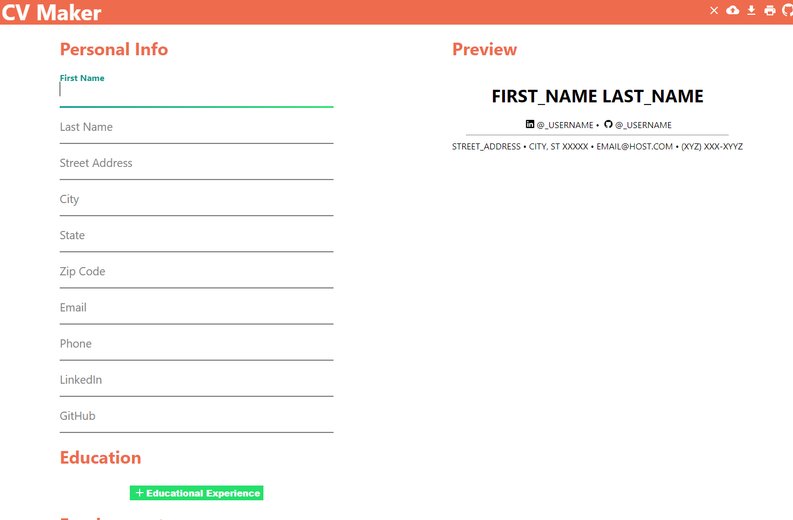

# CV Maker

CV Maker is an easy way to write a professional looking resume.

## Features

- Automatic formatting
- Save CV as PDF
- Export CV as JSON
- Load previously exported CV data
- Handles Personal Info, Education, Employment Experience, and Technical Experience

## Installation

- Project is hosted publicly here 👉[CV Maker](https://github.com/facebook/create-react-ap)
- Can be run locally by cloning this repo, and running `npm install` and `npm start`

## Support

If you are having issue, please open an issue ticket.

## License

This project is licensed under the [GNU GPLv3 license](LICENSE).

This project was bootstrapped with [Create React App](https://github.com/facebook/create-react-app).
